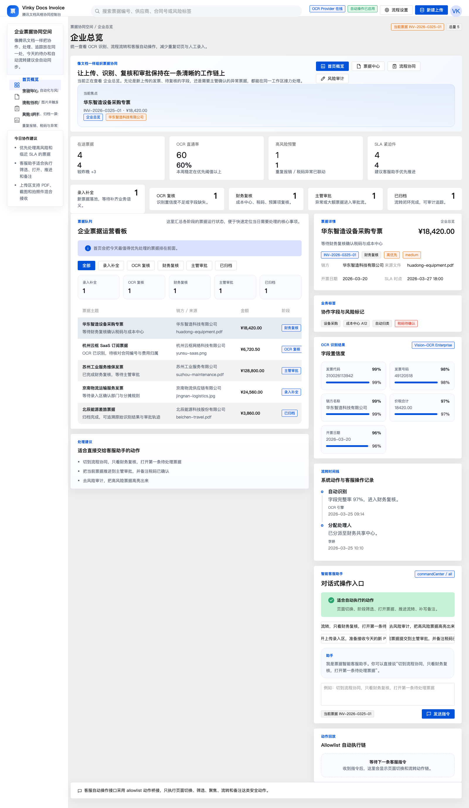
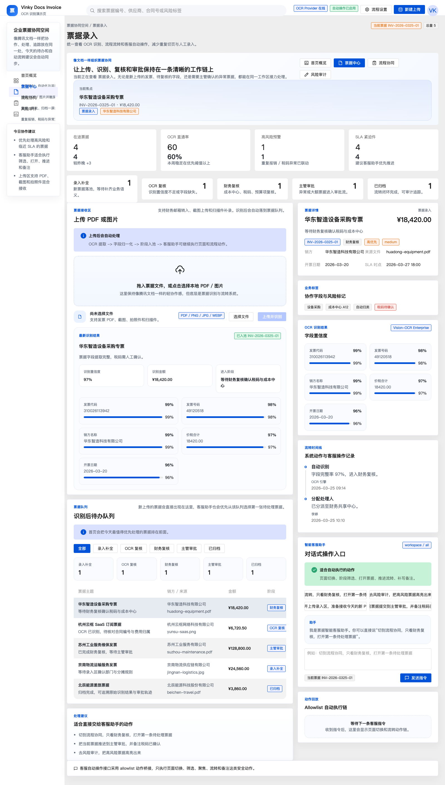
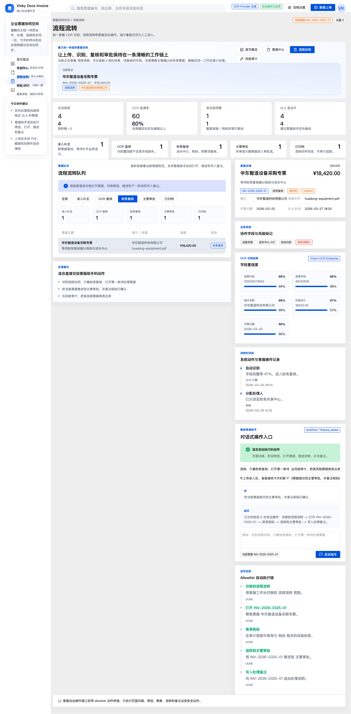
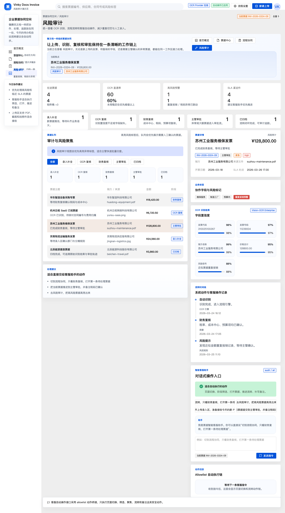
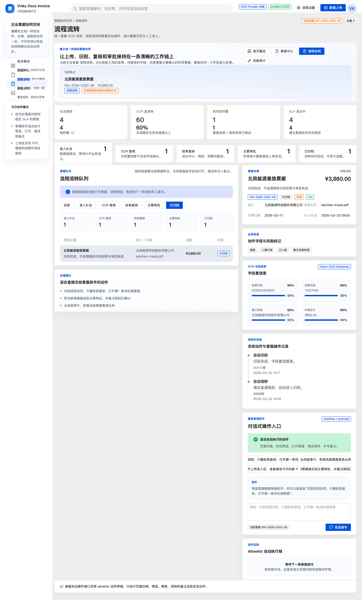

# Enterprise Invoice Agent

企业票据管理平台原型，面向“上传票据 -> OCR 提取 -> 队列流转 -> 风险审计 -> 智能客服自动操作”这条完整链路。

这个仓库现在已经不是单纯的界面草稿，而是一套可以直接演示产品逻辑的前后端一体化原型：

- 支持 PDF / 图片票据上传
- 支持 OCR 字段抽取与结构化展示
- 支持票据队列、复核、审批、归档等流程状态
- 支持自然语言驱动的安全页面自动操作
- 支持多种演示场景截图与产品化 README 展示

## 项目亮点

- `腾讯文档风格前端`
  顶部工具栏、左侧文档式导航、蓝白轻协作视觉体系，整体更像腾讯系内部协同产品，而不是普通后台模板。
- `OCR Provider 可替换`
  默认是 deterministic mock provider，方便演示；接真实 OCR 服务时只需要保持返回结构一致。
- `智能客服动作桥`
  自然语言不会直接“瞎点页面”，而是先被解析成 allowlist 安全动作，再由前端执行页面切换、筛选、聚焦、推进和备注。
- `多场景产品展示`
  首页总览、OCR 识别、审批推进、风险审计、归档追踪都做成了稳定的演示状态，方便理解完整产品链路。

## 截图画廊

### 1. 首页总览

适合展示项目首页、今日待办、阶段积压和右侧协同详情。



### 2. OCR 识别结果

适合展示票据上传、OCR 结果卡片、字段置信度和“识别后进入队列”的产品链路。



### 3. 智能客服核心玩法

适合展示一句话驱动页面和流程动作的主卖点。



### 4. 风险审计场景

适合展示高风险票据高亮、重复报销预警和审计聚焦视图。



### 5. 归档追踪场景

适合展示归档后的可追溯能力，包括时间线、OCR 记录和流程留痕。



## 产品定位

这个项目更像一个“企业票据自动化中台”的产品原型，而不是一个只有页面的静态 demo。

它主要解决三类问题：

1. `票据接收与识别`
   把 PDF、扫描件、截图、拍照件统一接进平台，自动识别基础字段。
2. `流程协同与状态推进`
   把 OCR 结果送进复核、审批、归档等流程，减少人工切换系统和重复录入。
3. `对话式自动操作`
   用户直接告诉客服助手“切到哪个界面、只看什么、推进哪张票据”，平台自动执行对应的安全动作链。

## 核心玩法

你可以把它理解成“票据平台 + OCR + 企业客服助手”的组合：

- 用户上传一张 PDF 或图片
- OCR provider 返回结构化字段
- 系统把票据写入当前队列
- 用户在右侧客服面板输入一句话，例如：
  - `切到流程协同，只看财务复核，打开第一条待处理票据`
  - `把当前票据提交到主管审批，并备注税码已确认`
  - `去风险审计，把高风险票据高亮出来`
- 后端把自然语言拆成结构化动作：
  - `navigate`
  - `apply_filter`
  - `focus_invoice`
  - `advance_stage`
  - `highlight_risk`
  - `append_note`
- 前端回放执行过程，并把流转结果同步写进票据时间线

## 演示页面

为了方便截图、验收和产品演示，仓库额外提供了多个固定状态的演示路由：

- `/`
  首页总览页
- `/workspace-play`
  OCR 上传结果页
- `/core-play`
  客服自动推进审批页
- `/audit-play`
  风险审计高亮页
- `/archive-play`
  归档追踪页

这些页面的状态是预置好的，适合：

- README 产品图
- 方案文档截图
- 给设计、产品、老板演示
- 回归检查不同业务状态的 UI 是否正常

## 技术栈

- `Next.js 15`
- `React 19`
- `TypeScript`
- `TDesign React`
- `Vitest`
- `Playwright`

## 架构说明

### 1. 前端层

前端围绕 [components/platform-shell.tsx](/Users/sanbu/Code/2026重要开源项目/vinky/enterprise-invoice-agent/components/platform-shell.tsx) 组织，负责：

- 顶部导航与整体布局
- 当前视图状态管理
- 阶段筛选与票据焦点管理
- 智能客服动作回放
- OCR 上传与详情展示联动

### 2. OCR 层

[lib/ocr.ts](/Users/sanbu/Code/2026重要开源项目/vinky/enterprise-invoice-agent/lib/ocr.ts) 负责 OCR provider 抽象：

- `mock` 模式下，按文件信息生成稳定的结构化结果
- `remote` 模式下，可透传到真实 OCR 服务

只要远程 OCR 返回 `OcrResult` 结构，前端和平台逻辑无需改动。

### 3. 票据仓库层

[lib/store.ts](/Users/sanbu/Code/2026重要开源项目/vinky/enterprise-invoice-agent/lib/store.ts) 负责演示态数据存储：

- 获取票据快照
- 写入 OCR 新票据
- 应用客服动作后的流转结果

当前实现是内存仓库，方便原型快速迭代。后续可以替换为数据库。

### 4. 智能客服动作规划层

[lib/copilot.ts](/Users/sanbu/Code/2026重要开源项目/vinky/enterprise-invoice-agent/lib/copilot.ts) 负责：

- 解析自然语言
- 识别目标视图 / 阶段 / 票据 / 风险标签
- 生成 allowlist 动作链
- 避免越权和不安全动作

这部分是整个项目的关键差异点，因为它让“企业客服自动操作平台”成为可落地交互，而不是单纯聊天窗口。

## API 说明

### `POST /api/invoices/upload`

上传 PDF / 图片，触发 OCR，并返回：

- 最新快照 `snapshot`
- 新创建票据 `createdInvoice`
- 前端建议聚焦的票据 `focusInvoiceId`

### `POST /api/copilot`

传入：

- 客服指令 `command`
- 当前界面上下文 `context`

返回：

- 结构化执行计划 `plan`
- 执行后的最新快照 `snapshot`

## 目录结构

```text
enterprise-invoice-agent/
├─ app/
│  ├─ api/
│  │  ├─ copilot/
│  │  └─ invoices/upload/
│  ├─ page.tsx
│  ├─ workspace-play/page.tsx
│  ├─ core-play/page.tsx
│  ├─ audit-play/page.tsx
│  └─ archive-play/page.tsx
├─ components/
│  ├─ platform-shell.tsx
│  ├─ overview-panel.tsx
│  ├─ workflow-board.tsx
│  ├─ upload-workspace.tsx
│  ├─ invoice-detail.tsx
│  └─ copilot-console.tsx
├─ lib/
│  ├─ types.ts
│  ├─ mock-data.ts
│  ├─ store.ts
│  ├─ ocr.ts
│  ├─ copilot.ts
│  └─ demo-pages.tsx
├─ public/screenshots/
├─ tests/copilot.test.ts
└─ docs/plans/
```

## 本地启动

```bash
npm install
npm test
npm run build
npm run dev
```

默认访问：

- 首页：`http://localhost:3000`
- OCR 演示页：`http://localhost:3000/workspace-play`
- 核心玩法页：`http://localhost:3000/core-play`
- 风险审计页：`http://localhost:3000/audit-play`
- 归档追踪页：`http://localhost:3000/archive-play`

## 配置 OCR Provider

默认使用 mock：

```bash
OCR_PROVIDER_MODE=mock
```

接入真实 OCR：

```bash
OCR_PROVIDER_MODE=remote
OCR_PROVIDER_URL=https://your-ocr-service.example.com/extract
OCR_PROVIDER_NAME=Your OCR Service
```

## 测试

当前包含基础动作规划测试：

```bash
npm test
```

覆盖点包括：

- 队列筛选与打开票据
- 当前票据推进审批
- 不安全或不支持动作的兜底处理

## 适合继续扩展的方向

如果你要把它继续做成正式项目，最自然的下一步是：

1. 接数据库
   把内存仓库替换成 Postgres / MySQL / Supabase。
2. 接真实 OCR 模型
   接通企业内部 OCR 服务，或者外部票据识别 API。
3. 接认证与权限
   支持财务、共享中心、主管、审计等多角色权限。
4. 接真正的流程引擎
   把“审批、驳回、流转、归档”接到可配置工作流。
5. 接真实页面自动化
   让客服助手不仅能操作当前平台，也能桥接企业内部其他系统。

## 当前限制

- 当前数据是演示态内存数据，不会持久化
- OCR provider 默认是 mock，不是生产识别模型
- 客服自动操作目前只作用于当前平台 allowlist 动作
- 尚未接登录、权限、数据库和多租户

## 路线图

- [x] 企业票据管理前端原型
- [x] PDF / 图片上传与 OCR 抽象
- [x] 流程流转看板
- [x] 智能客服动作规划器
- [x] README 多场景截图资产
- [ ] 数据库存储
- [ ] 真实 OCR 服务接入
- [ ] 角色权限体系
- [ ] 审批流配置能力
- [ ] 多组织 / 多租户

## 贡献说明

如果你准备继续维护这个项目，建议优先遵循以下原则：

- 所有新交互先考虑是否能复用 allowlist 动作桥
- 所有演示页都保持稳定状态，方便截图和文档复用
- OCR 和数据层继续保持可替换，不要把供应商实现写死进 UI
